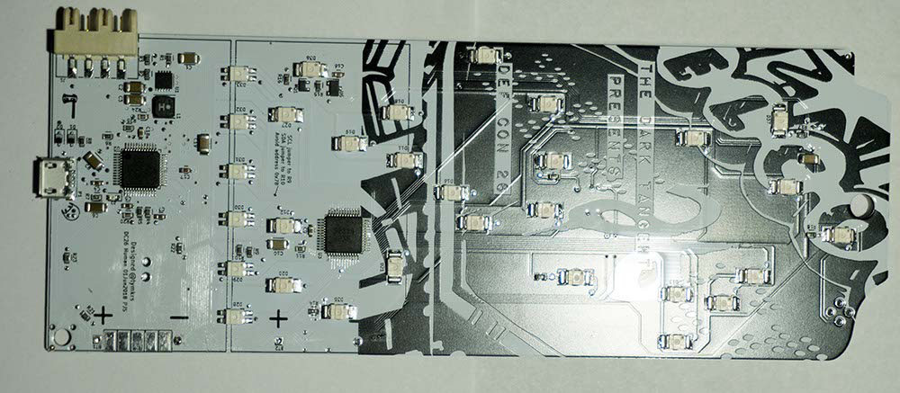

# Colin is not very smart #

This repo was going to be a cool DEFCON26 badge hacking repo. Unfortunately, I couldn't resist the call of testing EMFI without doing enough checking on settings, so I destroyed the micro on it (oops). It happens.

I've included some photos and notes I started to make. But that is all there will be here. Here's the backside:



## Part Numbers ##

Backside:
Main micro is a PIC32MM0256GPM048 (U2).

The secondary device (U3) is marked:

```
S2319
3236
```

I'm not sure what that thing is. I assume I2C extender but could be a micro programmed with some protocol.

Frontside:


On the upper right, there is a PIC12F508 (U7). There are some smaller SOT23-6 / SOT323-6 looking sized devices.

## Programming PINOUT ##

There is a programmer header under the lower battery holder. The pinout appears to be a standard microchip 5-pin programming header, the pinout, counting from the pin near the "-" mark being pin 1, counting to Pin 5 being the "+" mark:

Pin 5 PGEC2 (U7-21, PIC32 ICSP Clock)
Pin 4 PGED2 (U7-22, PIC32 ICSP Data)
Pin 3: GND
Pin 2: VDD
Pin 1: MCLR (U7-19, PIC32 MCLR)

This chip ALSO supports JTAG. The JTAG does not go to an obvious programming header location, so might need some fly wires to test this thing.